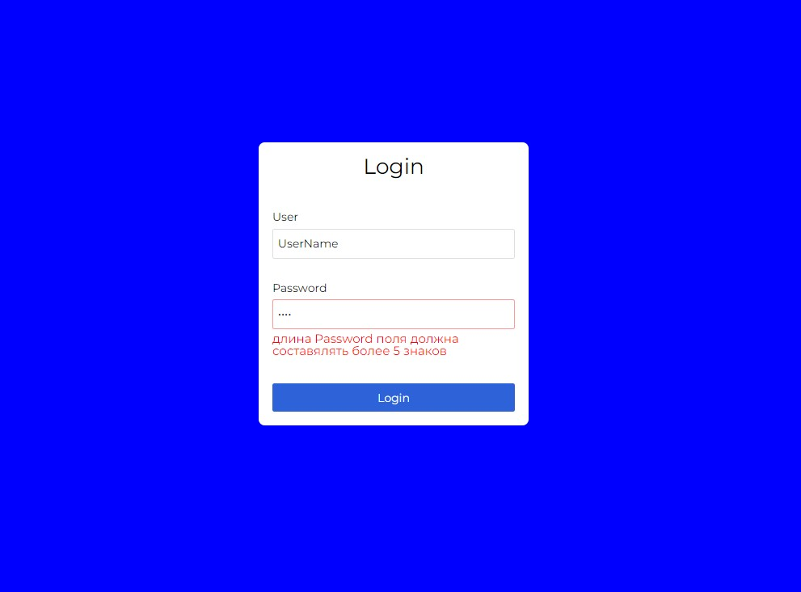
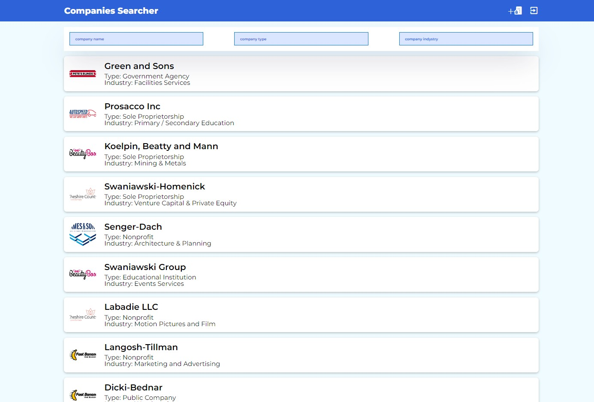
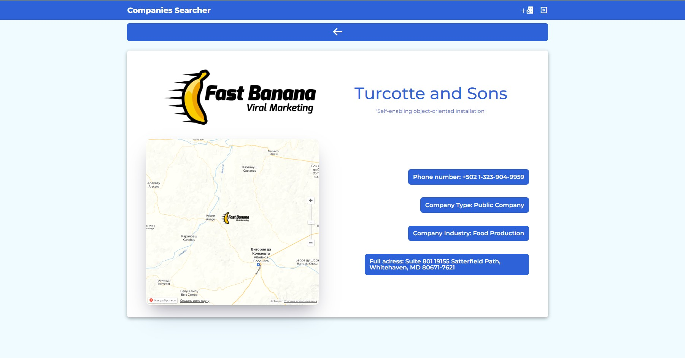

<h2>Companies Searcher</h2>
<ul>
    <li>чистый JS</li>
    <li>БЭМ</li>
    <li>не конечная реализация</li>
</ul>
<h3>Авторизация</h3>
<ul>
    <li>Присутствует валидация полей</li>
    <li>Переход на страницу с компаниями не возможен, до тех пор,
        пока пользователь не зарегистрируется</li>
</ul>

<h3>Список компаний</h3>
<ul>
    <li>Реализована фильтрация копаний по трем полям
     (полное совпадение)</li>
    <li>Реализована пагинация компаний при скроллинге страницы</li>
    <li>При нажатии на карточку компаний появляется
        компонента с детальной информацией о ней</li>
</ul>

<h3>Детальная информаци о компании</h3>
